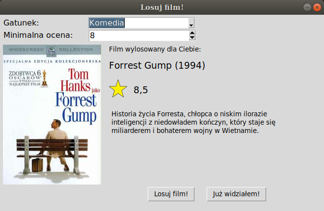

## Table of contents
* [General info](#general-info)
* [Technologies](#technologies)
* [Setup](#setup)
* [Documentation](#documentation)
* [License](#license)

## General info
Project developed for Scripting Languages class (AGH UST).

A task of application is to draw a film from Filmweb website.\
A user can specify details, such as category and minimal rate.\
Films marked as viewed by user are skipped during the drawing.



## Technologies
Project is created with:
* Python 3.6.9
* Tkinter 8.6\
graphical user interface library
* BeautifulSoup 4.9\
library for pulling data out of HTML files

Other needed libraries in [requirements.txt](./requirements.txt).

## Setup
To install all dependencies:
```
$ pip3 install -r requirements.txt
```

To run this project:
```
$ python3 src/main.py
```

## Documentation
All classes are documented. Check e.g.
```
>>> print(Film.__doc__)

    A class used to represent a film.

    Attributes
    ----------
    title : str
        the title of the film
    year : str
        the release date of the film
    url : str
        url address to information about film on Filmweb website
    rate : int
        the rate of the film on Filmweb website
    poster_url : str
        url address of the film poster

    Methods
    -------
    getTitleWithYear()
        returns str contains title and release date of the film
        e.g. "Iron Man (2008)"
```

## License
*[MIT LICENSE](./LICENSE)*
