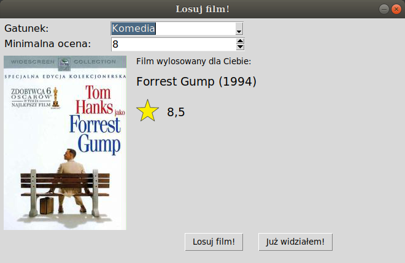

## Table of contents
* [General info](#general-info)
* [Technologies](#technologies)
* [Setup](#setup)

## General info
A task of application is to draw a film from Filmweb website.\
A user can specify details, such as category and minimal rate.\
Films marked as viewed by user are skipped during the drawing.



## Technologies
Project is created with:
* Python 3.6.9
* Tkinter 8.6

## Setup
To run this project:
```
$ python3 main.py
```
